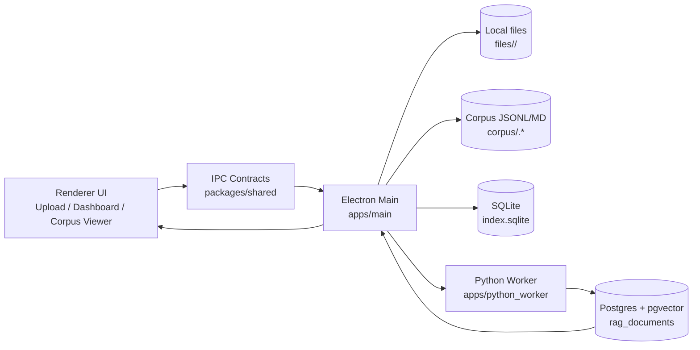

# RAG Ingest Studio + RAG Chat

**Language:** [English](README.en.md) | [German](README.md)

Desktop stack (Electron + React + TypeScript + FastAPI) for local document ingestion and chat via vector retrieval:

- Upload via file picker, drag & drop, and recursive folder ingest
- Parsing + chunking + local embeddings (Python worker)
- Vector backends per environment:
  - `postgres` (pgvector)
  - `sqlite_embedded` (no separate server)
  - `qdrant_embedded` (local Qdrant storage folder, no separate server)
- Local index DB in SQLite (`index.sqlite`) for document/job metadata
- Editable corpus as JSONL (optional Markdown)
- Reindex per document, bulk, and “reindex all”
- Chat UI with source links (external) and answer metrics (duration, tokens, tokens/s)

## Monorepo layout

```text
documentHandling/    Document management + ingestion UI (Electron)
chatBot/             Chat UI (Electron)
documentApi/         FastAPI backend + worker + vector stores
scripts/             Launcher scripts (including documentApi runner)
batchTest/           Batch chat against the API + Excel export (Python)
```

## System diagram (ingest + reindex)



### What the diagram shows

1. **The UI starts the process**  
   In the renderer the user picks files (picker or drag & drop), sees status on the dashboard, and can trigger reindex/remove.

2. **IPC decouples frontend and backend**  
   The UI never talks directly to the file system, Python, or Postgres. It sends only typed IPC requests via `packages/shared`.

3. **Electron Main orchestrates everything**  
   The main process is central control: it accepts jobs, writes metadata to SQLite, manages file paths, and coordinates the worker.

4. **Local artifacts are persisted**  
   Original files go to `files/<docId>/`.  
   The editable corpus is stored as `corpus/<docId>.jsonl` (optional `.md`) and is the source of truth for later reindex runs.

5. **Python worker does parsing + embeddings**  
   The worker reads local input, runs parsing/chunking, and produces embeddings for chunks.

6. **Postgres (pgvector) stores vectors for retrieval**  
   Points are written to `rag_documents`. Before reindex, existing points for the document are removed so state stays idempotent.

7. **Feedback to the UI**  
   The main process updates job/document status in SQLite and returns progress to the UI so the dashboard and corpus viewer show current state.

## Requirements

- Node.js 20+
- Python 3.10+
- Docker (optional, for Postgres/pgvector only)

## 1) Start Postgres (pgvector) locally

```bash
docker run --name rag-pg -e POSTGRES_PASSWORD=postgres -e POSTGRES_USER=postgres -e POSTGRES_DB=rag -p 5432:5432 -d pgvector/pgvector:pg16
```

Postgres is then reachable at `localhost:5432`.

## 2) Set up documentApi Python environment

In the `documentApi` directory:

```bash
python -m venv .venv
# Windows (PowerShell):
.venv\Scripts\Activate.ps1
# macOS/Linux:
source .venv/bin/activate
python -m pip install -r requirements.txt
```

Install all API dependencies (e.g. `qdrant-client`) in this venv:

```bash
documentApi\.venv\Scripts\python.exe -m pip install -r documentApi/requirements.txt
```

## 3) Install Node dependencies

At repository root:

```bash
npm install
```

## 4) Start development

At repository root:

```bash
npm run dev
```

This starts:

- **documentApi** (FastAPI/Uvicorn) at `http://127.0.0.1:8000`
- Vite renderer at `http://localhost:5173`
- Electron main (starts only when renderer **and** port 8000 are ready)

API only in a separate terminal: `npm run dev:api`

Note on `qdrant_embedded`: the API runner starts **without** `uvicorn --reload` by default because the Qdrant folder is exclusively locked.  
Enable reload only explicitly:

```bash
# PowerShell
$env:DOCUMENT_API_RELOAD="1"
npm run dev:api
```

## 5) Production build

```bash
npm run build
```

## 6) Production start

```bash
npm run start
```

The script builds renderer + main first, then starts Electron in production mode.

## Data layout / offline behaviour

All artifacts are stored locally under:

`~/RAGIngestStudio/`

Substructure:

- `files/<docId>/` – original files
- `corpus/<docId>.jsonl` – editable source of truth
- `corpus/<docId>.md` – optional Markdown export
- `index.sqlite` – documents + jobs
- `settings.json` – local settings (including vector backend per environment)
- `vector_sqlite/` – storage for `sqlite_embedded`
- `vector_qdrant/` – storage for `qdrant_embedded`

## Core features

- **Dashboard** with filter/search, status, chunk count, bulk actions
- **Upload** via picker or drag & drop
- **Corpus viewer** (editable), save + reindex
- **Settings** per environment including backend selection (`postgres`, `sqlite_embedded`, `qdrant_embedded`)
- **Connection test** per backend (Postgres/SQLite/Qdrant)
- **CSV export** of the document list
- **Chat** with sources, “website” button (external browser), copy button, and answer metrics

## batchTest (batch chat + Excel)

The `batchTest/` folder contains a small **Python** tool to run many chat questions against the running **documentApi** and write an **Excel workbook** with answers, token metrics, speed, and retrieved context chunks.

> German: [README.md](README.md) — same **batchTest** section.

### Prerequisites

- **documentApi** reachable (same URL as the app, default `http://localhost:8000`)
- Same index/vector backend as your chat session so retrieval matches expectations
- Dependencies: `pip install -r batchTest/requirements.txt` (`httpx`, `openpyxl`)

### Quick start

```bash
cd batchTest
pip install -r requirements.txt
cp batch_config.example.json batch_config.json
# Edit batch_config.json (questions, API URL, optional chat settings)
python batch_chat.py --config batch_config.json
```

On Windows PowerShell, if `cp` is missing: `Copy-Item batch_config.example.json batch_config.json`.

### Configuration (`batch_config.json`)

| Area | Meaning |
|------|--------|
| `apiBaseUrl` | Base URL of documentApi (no trailing slash required) |
| `requestTimeoutSeconds` | HTTP timeout per request |
| `questions` | List of question strings |
| `questionsFile` | Optional path to a text file: one question per line; lines starting with `#` are comments |
| `language` | `"de"` or `"en"`, or omit (same as API) |
| `history` | Optional list of `{"role":"user"|"assistant","content":"..."}` (same as chat API) |
| `applyChatSettings` | If `true`, loads current settings with `GET /api/chat/settings`, merges with `chatSettings`, then `PUT`s them |
| `chatSettings` | Same fields as the app chat: `llmApiKey`, `llmBaseUrl`, `llmModel`, `temperature`, `maxTokens`, `topK`, `systemPrompt`, `encryptionKey` (camelCase as in the API) |
| `restoreChatSettingsAfterRun` | If `true`, restores the snapshot from before `applyChatSettings` after the run |
| `outputExcel` | Output `.xlsx` path (relative paths are resolved from the **current working directory**) |

### Excel output

The workbook contains:

- **Meta** – UTC timestamp, API URL, config path, optional applied `chatSettings`
- **Results** – one row per question: answer, HTTP error (if any), `elapsedMs`, prompt/completion/total tokens, tokens/s, chunk count, short chunk list, detailed chunk text
- **Chunks** – one row per retrieved chunk: question number, position, file name, `chunkIndex`, `documentId`, similarity, source, text excerpt

Long text fields are truncated where needed for Excel cell limits.

### Idempotency notes

- Before each reindex, existing vectors for `documentId` are removed from Postgres.
- Point IDs are deterministic via `sha256(documentId + ":" + chunkIndex)`.
- JSONL remains the editable source of truth for later reindex runs.
