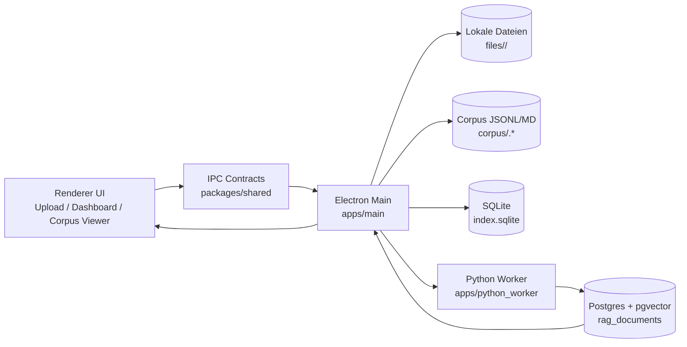

# RAG Ingest Studio

Produktionsnahe Desktop-App (Electron + React + TypeScript) zur lokalen Vorbereitung von Dokumenten fuer RAG:

- Upload per File Picker und Drag & Drop
- Parsing + Chunking + lokale Embeddings (Python Worker)
- Indexierung in Postgres mit `pgvector` (`rag_documents`)
- Lokale Index-DB in SQLite (`better-sqlite3`)
- Editierbarer Corpus als JSONL (und optional Markdown)
- Reindex / Remove je Dokument oder im Bulk

## Monorepo Struktur

```text
apps/
  main/           Electron Main Process + Services
  renderer/       React UI (Vite)
  python_worker/  Parsing + Embedding Worker (Python)
packages/
  shared/         Gemeinsame TypeScript-Typen (IPC Contracts)
```

## Systemdiagramm (Ingest + Reindex)



### Was das Diagramm genau zeigt

1. **UI startet den Prozess**  
   Im Renderer waehlt der User Dateien aus (Picker oder Drag & Drop), sieht Status im Dashboard und kann Reindex/Remove ausloesen.

2. **IPC entkoppelt Frontend und Backend**  
   Die UI spricht nie direkt mit Dateisystem, Python oder Postgres. Sie sendet nur typisierte IPC-Requests ueber `packages/shared`.

3. **Electron Main orchestriert alles**  
   Der Main Process ist die zentrale Steuerung: Er nimmt Jobs an, schreibt Metadaten in SQLite, verwaltet Dateipfade und koordiniert den Worker.

4. **Lokale Artefakte werden persistiert**  
   Originaldateien landen in `files/<docId>/`.  
   Der editierbare Corpus wird als `corpus/<docId>.jsonl` (optional `.md`) gespeichert und dient als Source of Truth fuer spaetere Reindex-Laeufe.

5. **Python Worker macht Parsing + Embeddings**  
   Der Worker liest den lokalen Input, fuehrt Parsing/Chunking aus und erzeugt Embeddings fuer die Chunks.

6. **Postgres (pgvector) speichert die Vektoren fuer Retrieval**  
   Die erzeugten Punkte werden in `rag_documents` geschrieben. Vor Reindex werden bestehende Punkte des Dokuments entfernt, damit der Zustand idempotent bleibt.

7. **Rueckmeldung an die UI**  
   Der Main Process aktualisiert Job-/Dokumentstatus in SQLite und liefert den Fortschritt zurueck an die UI, damit Dashboard und Corpus Viewer den aktuellen Stand anzeigen.

## Voraussetzungen

- Node.js 20+
- Python 3.10+
- Docker (fuer lokale Postgres-Instanz mit pgvector)

## 1) Postgres (pgvector) lokal starten

```bash
docker run --name rag-pg -e POSTGRES_PASSWORD=postgres -e POSTGRES_USER=postgres -e POSTGRES_DB=rag -p 5432:5432 -d pgvector/pgvector:pg16
```

Danach ist Postgres auf `localhost:5432` erreichbar.

## 2) Python Worker einrichten

Im Verzeichnis `apps/python_worker`:

```bash
python -m venv .venv
# Windows (PowerShell):
.venv\Scripts\Activate.ps1
# macOS/Linux:
source .venv/bin/activate
pip install -r requirements.txt
```

Wichtig: Stelle sicher, dass `python` im Terminal auf dieses venv zeigt, wenn du die App startest.

## 3) Node Dependencies installieren

Im Repository-Root:

```bash
npm install
```

## 4) Development starten

Im Repository-Root:

```bash
npm run dev
```

Das startet:

- **documentApi** (FastAPI/Uvicorn) auf `http://127.0.0.1:8000` — venv unter `documentApi/.venv` muss existieren (`pip install -r documentApi/requirements.txt`)
- Vite Renderer auf `http://localhost:5173`
- Electron Main Process (startet erst, wenn Renderer **und** Port 8000 bereit sind)

Nur die API in einem eigenen Terminal: `npm run dev:api`

## 5) Production Build

```bash
npm run build
```

## 6) Produktionsstart

```bash
npm run start
```

Das Skript baut zuerst Renderer + Main und startet danach Electron im Production-Modus.

## Datenablage / Offline Verhalten

Alle Artefakte liegen lokal in:

`~/RAGIngestStudio/`

Unterstruktur:

- `files/<docId>/` - Originaldateien
- `corpus/<docId>.jsonl` - editierbare Source of Truth
- `corpus/<docId>.md` - optionaler Markdown-Export
- `index.sqlite` - Dokumente + Jobs
- `settings.json` - lokale Einstellungen

## Kern-Funktionen

- **Dashboard** mit Filter/Suche, Status, Chunk-Anzahl, Bulk-Aktionen
- **Upload** per Picker oder Drag & Drop
- **Corpus Viewer** (editierbar), Speichern + Reindex
- **Settings** fuer DB Host/Port/Name/User/Passwort, Vector Table Name, Chunking, Embedding Model, Markdown Toggle
- **Connection Test** fuer Postgres (Upload erst nach erfolgreichem Test moeglich)
- **CSV Export** der Dokumentliste

## Hinweise zu Idempotenz

- Vor jedem Reindex werden bestehende Vektoren fuer `documentId` aus Postgres entfernt.
- Point IDs sind deterministisch via `sha256(documentId + ":" + chunkIndex)`.
- JSONL bleibt die editierbare Truth-Quelle fuer spaetere Reindex-Laeufe.
